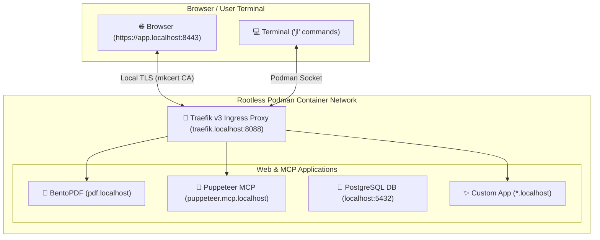

# 🌐 Local Services & Container Mesh Guide

This guide details the setup, daily operation, and management of the **Tier 2 Local Service Mesh** powered by **Podman** (rootless), **Traefik v3**, **`mkcert`** (local TLS), and the **`just` (`jl`) task runner**.

---

## 🏗️ Architecture Overview

The local service mesh runs inside your user space at `~/.local/share/local-services/`:



* **Rootless Podman**: Secure, daemonless container execution without `sudo`.
* **Traefik v3 Proxy**: Dynamically detects running containers via Podman API socket and routes HTTP (`8080`) / HTTPS (`8443`) traffic automatically.
* **`mkcert`**: Installs a local Certificate Authority (CA) into your operating system & browser trust stores for zero-warning green SSL locks on `*.localhost`.
* **`jl` Alias**: A portable shortcut for `just -f ~/.local/share/local-services/justfile`.

---

## ⚡ 1. Setup & First-Time Onboarding

### Step 1: Run the Setup Script
```bash
./install-local-services.sh
```
> [!NOTE]
> `install-local-services.sh` includes an automatic **prerequisite check**. It verifies that `./install-dev-env.sh` (Tier 1) has been executed first to bootstrap your shell profiles, core CLIs, and editor configurations.

This script automatically:
1. Verifies base environment prerequisites.
2. Installs `podman`, `podman-compose`, `mkcert`, and `just`.
2. Activates the user-level `podman.socket` API service.
3. Generates wildcard SSL certificates for `*.localhost`.
4. Provisions the compose stack at `~/.local/share/local-services/docker-compose.yml`.
5. Adds the `jl` task runner alias to your `~/.bashrc`.

### Step 2: Reload Your Shell Session
```bash
exec bash
```

### Step 3: Verify Running Web Services
Open your web browser and navigate to the pre-configured URLs:

| Service | Access URL | Description |
| :--- | :--- | :--- |
| **BentoPDF Toolkit** | [`https://pdf.localhost`](https://pdf.localhost) | Privacy-first local PDF editor & toolkit UI |
| **Traefik Dashboard** | [`http://traefik.localhost:8088`](http://traefik.localhost:8088) | Ingress routing overview & container health |
| **Puppeteer MCP Server** | [`http://puppeteer.mcp.localhost`](http://puppeteer.mcp.localhost) | Headless browser agent for OpenCode & Hermes |
| **PostgreSQL Database** | `localhost:5432` | Local dev database (User: `devuser`, DB: `devdb`) |

---

## 🎮 2. Daily Management Cheatsheet (`jl`)

Use the `jl` alias from any directory in your terminal to control your local services:

| Command | Action |
| :--- | :--- |
| `jl` | List all available management commands |
| `jl status` | View container status, ports, and health |
| `jl up` | Start all local container services |
| `jl down` | Stop all local container services |
| `jl restart` | Restart all container services |
| `jl update` | Run Podman auto-update for tagged containers |
| `jl logs` | Tail real-time logs for all services |
| `jl logs bentopdf` | Tail logs for a specific service (e.g. `bentopdf`) |
| `jl certs` | Regenerate `mkcert` local SSL certificates |
| `jl mcp-info` | Print connection snippets for OpenCode & Hermes Agent |

---

## ➕ 3. How to Add a New Container Cleanly

**No new scripts are needed to add containers.** Traefik v3 automatically watches your compose file and routes traffic dynamically without editing `/etc/hosts` or restarting proxies.

### Step-by-Step Example: Adding a `whoami` Test Container

1. **Edit the Compose File**:
   Open `~/.local/share/local-services/docker-compose.yml` in your editor:
   ```bash
   vim ~/.local/share/local-services/docker-compose.yml
   ```

2. **Add Your Service Block**:
   Append your service under the `services:` section using standard Traefik v3 labels:

   ```yaml
     # ✨ Example: Whoami HTTP Service
     whoami:
       image: traefik/whoami:latest
       container_name: whoami-test
       restart: unless-stopped
       networks:
         - local-mesh
       labels:
         - "traefik.enable=true"
         - "traefik.http.routers.whoami.rule=Host(`whoami.localhost`)"
         - "traefik.http.routers.whoami.entrypoints=web,websecure"
         - "traefik.http.routers.whoami.tls=true"
         - "traefik.http.services.whoami.loadbalancer.server.port=80"
   ```

3. **Apply the Changes**:
   ```bash
   jl up
   ```

4. **Access Your New Service**:
   Open [`https://whoami.localhost:8443`](https://whoami.localhost:8443) in your browser. Traefik immediately detects the new container and routes HTTPS traffic using your trusted `mkcert` SSL cert!

---

## ➖ 4. How to Remove a Container Cleanly

To cleanly remove a container service:

1. **Stop the Container**:
   ```bash
   podman stop whoami-test && podman rm whoami-test
   ```

2. **Remove from Compose File**:
   Open `~/.local/share/local-services/docker-compose.yml` and delete or comment out the service block.

3. **Refresh the Mesh**:
   ```bash
   jl up
   ```
   Traefik v3 instantly unregisters the route.

---

## 🤖 5. Connecting AI Agents (OpenCode & Hermes)

Running `./install-local-services.sh` automatically configures OpenCode and Hermes Agent to consume your containerized MCP servers:

### OpenCode (`~/.config/opencode/opencode.json`):
```json
{
  "$schema": "https://opencode.ai/config.json",
  "mcp": {
    "puppeteer": {
      "type": "remote",
      "url": "http://puppeteer.mcp.localhost/sse",
      "enabled": true
    }
  }
}
```

### Hermes Agent (`~/.hermes/config.yaml`):
```yaml
mcp_servers:
  puppeteer:
    url: "http://puppeteer.mcp.localhost/sse"
    transport: "sse"
```

---

## 🧹 6. Uninstallation & Teardown

To remove all local container services and clean up aliases:

```bash
./uninstall-local-services.sh
exec bash
```
