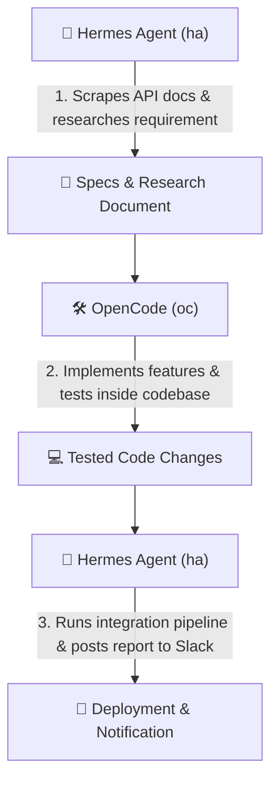

# 🤖 OpenCode & Hermes Agent Setup and Starter Guide

This guide provides a comprehensive introduction to setting up, configuring, and effectively using **OpenCode** and **Hermes Agent** in your development environment.

Although both tools utilize large language models to assist you, they are designed to be **complementary** with distinct scopes of usage:

* 🛠️ **OpenCode (`opencode` / `oc`)**: **Repository-Centric AI Coding Partner**. Optimized for inline code editing, multi-file refactoring, test generation, git integration, and IDE/TUI pair programming.
* 🤖 **Hermes Agent (`hermes` / `ha`)**: **System-Wide Autonomous AI Operator**. Optimized for long-running background execution, persistent cross-session memory, automated web research, skill creation, and workflow automation.

---

## ⚡ 1. First-Time Setup & Credential Configuration

### Step 1: Configure Provider API Keys
Both agents require access to LLM model providers (such as OpenAI, Anthropic, or local Ollama instances).

Add your API credentials to your local environment file (`~/.bashrc.local`):

```bash
# Open ~/.bashrc.local in your editor
vim ~/.bashrc.local

# Add your model provider keys:
export OPENAI_API_KEY="sk-proj-your-openai-key"
export ANTHROPIC_API_KEY="sk-ant-your-anthropic-key"
```

Reload your shell session:
```bash
exec bash
```

### Step 2: Initialize OpenCode
Navigate to any git repository and run `opencode` (or shorthand `oc`):

```bash
cd ~/my-project
oc
```
* On first run, OpenCode will index your repository context and load provider models.
* Use `/help` inside the OpenCode TUI to explore interactive commands.

### Step 3: Initialize Hermes Agent
Run the Hermes onboarding wizard:

```bash
hermes setup --portal
```
* Follow the interactive prompts to link your account or select model backends.
* Verify your configuration by running:
```bash
hermes doctor
```

---

## 🛠️ 2. OpenCode (`oc`): Scope & Workflow

### Primary Scope
* Interactive pair programming inside active code repositories.
* Reading codebase structure, understanding context across multiple files.
* Autonomous code generation, refactoring, and test writing.
* Executing terminal build commands and fixing syntax/runtime errors iteratively.

---

### Recommended Sample Tasks for OpenCode

#### Task A: Implement a New Feature with Tests
```bash
oc "Add a new REST API endpoint /api/v1/health with unit tests in Go/Python/Rust"
```
* **What OpenCode does**: Analyzes existing routing and controller patterns in your codebase, generates the new endpoint handler file, updates router declarations, and creates corresponding test files.

#### Task B: Multi-File Refactoring & Deprecation Cleanup
```bash
oc "Refactor all usages of deprecated function `oldLogger()` to `newStructuredLogger()` across the src/ directory"
```
* **What OpenCode does**: Performs workspace-wide search, inspects signatures, applies code replacements, and runs `npm test` or `go test` to confirm clean compilation.

#### Task C: Interactive PR & Code Review
```bash
oc "Review git diff HEAD~1 and generate a summary of potential edge cases or security vulnerabilities"
```

---

### Recommended MCP (Model Context Protocol) Servers for OpenCode

OpenCode benefits from MCP tools that expose repository context, database schemas, and git metadata:

| MCP Server | Description | Best Use Case in OpenCode |
| :--- | :--- | :--- |
| **PostgreSQL / SQLite MCP** | Exposes live DB schema definitions | Allows OpenCode to generate accurate ORM models, SQL queries, and migrations matching your DB schema. |
| **Git / GitHub MCP** | Interacts with pull requests, issues, & commit history | Enables OpenCode to draft PR descriptions, pull context from open issues, or analyze git blame. |
| **Filesystem / Ripgrep MCP** | Advanced search & indexing | Speeds up multi-file navigation and large codebase dependency resolution. |

#### Default Pre-configured MCP Setup for OpenCode
Running `./install-dev-env.sh` automatically provisions default MCP servers in **`~/.config/opencode/opencode.json`**:

```json
{
  "$schema": "https://opencode.ai/config.json",
  "mcp": {
    "filesystem": {
      "type": "local",
      "command": ["npx", "-y", "@modelcontextprotocol/server-filesystem", "."],
      "enabled": true
    },
    "git": {
      "type": "local",
      "command": ["npx", "-y", "@modelcontextprotocol/server-git"],
      "enabled": true
    },
    "postgres": {
      "type": "local",
      "command": ["npx", "-y", "@modelcontextprotocol/server-postgres"],
      "enabled": true
    }
  }
}
```

---

## 🤖 3. Hermes Agent (`ha`): Scope & Workflow

### Primary Scope
* Autonomous, system-wide task execution and workflow automation.
* Background job execution and scheduled cron monitoring.
* Learning and storing persistent "skills" (custom procedures) across developer sessions.
* External web research, documentation scraping, and multi-channel notification (Slack/Discord).

---

### Recommended Sample Tasks for Hermes Agent

#### Task A: Autonomous Web Research & Documentation Synthesis
```bash
ha "Search the web for the latest security advisories on Kubernetes v1.30 and create a summary report in ~/k8s-security.md"
```
* **What Hermes does**: Uses browser/fetch tools autonomously, browses release notes and advisories, synthesizes findings, and saves a markdown report.

#### Task B: Background Log Monitoring & Automated Alerting
```bash
ha "Monitor /var/log/app.log for any 'CRITICAL' errors every 15 minutes. If found, summarize the stack trace."
```
* **What Hermes does**: Schedules a recurring cron task using its native scheduler, monitors logs silently, and notifies you when anomalies occur.

#### Task C: Custom Skill Creation & Persistence
```bash
ha "Learn how to build and verify docker images in this repo, then save this as a reusable skill named 'build-container'"
```
* **What Hermes does**: Executes the build commands, analyzes success steps, and records an executable skill in `~/.hermes/skills/` for future instant reuse.

---

### Recommended MCP Servers & Integrations for Hermes

Hermes excels with MCP servers that extend web browsing, communication, and external API control:

| MCP Server | Description | Best Use Case in Hermes |
| :--- | :--- | :--- |
| **Puppeteer / Playwright MCP** | Headless browser automation | Enables Hermes to log into developer portals, fill forms, and render dynamic web pages. |
| **Fetch / REST API MCP** | HTTP client & webhooks | Allows Hermes to query external APIs (AWS, Azure, Cloudflare) and parse JSON metrics. |
| **GitHub MCP** | Issue & PR management | Allows Hermes to create, search, and update GitHub issues & release notes. |

#### Default Pre-configured MCP Setup for Hermes Agent
Running `./install-dev-env.sh` automatically provisions default MCP servers in **`~/.hermes/config.yaml`**:

```yaml
mcp_servers:
  puppeteer:
    command: "npx"
    args: ["-y", "@modelcontextprotocol/server-puppeteer"]
  fetch:
    command: "npx"
    args: ["-y", "@modelcontextprotocol/server-fetch"]
  github:
    command: "npx"
    args: ["-y", "@modelcontextprotocol/server-github"]
```

---

## 🔄 4. Complementary Workflow Blueprint: How They Work Together

By combining **Hermes Agent** and **OpenCode**, you create a powerful end-to-end development pipeline:



### Real-World Example Scenario: Upgrading an External Library
1. **Research Phase (Hermes)**:
   ```bash
   ha "Research breaking changes between Redis client v4 and v5, and write a migration checklist in ~/redis-upgrade.md"
   ```
2. **Implementation Phase (OpenCode)**:
   ```bash
   oc "Read ~/redis-upgrade.md and refactor our Redis connection pool in src/db/redis.ts to support v5"
   ```
3. **Verification & Alert Phase (Hermes)**:
   ```bash
   ha "Run docker-compose up, verify API health endpoints, and summarize test results."
   ```

---

## 📌 5. Quick Reference & Command Cheatsheet

| Action | OpenCode (`oc`) | Hermes Agent (`ha`) |
| :--- | :--- | :--- |
| **Primary Focus** | Codebase editing, refactoring, & debugging | System tasks, web research, cron & automation |
| **Session Lifetime** | Workspace-scoped interactive session | Persistent 24/7 background agent |
| **Launch Command** | `opencode` (or `oc`) | `hermes` (or `ha`) |
| **Interactive TUI** | Yes (`oc`) | Yes (`hermes tui`) |
| **Config Directory** | `~/.config/opencode/` | `~/.config/hermes/` and `~/.hermes/` |
| **Onboarding Wizard**| Automatic on first run | `hermes setup --portal` |
| **Diagnostics** | `opencode --version` | `hermes doctor` |

---
