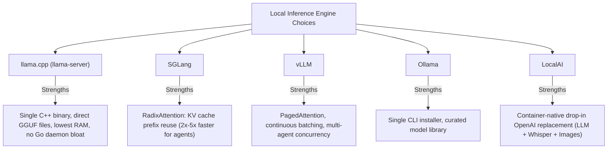
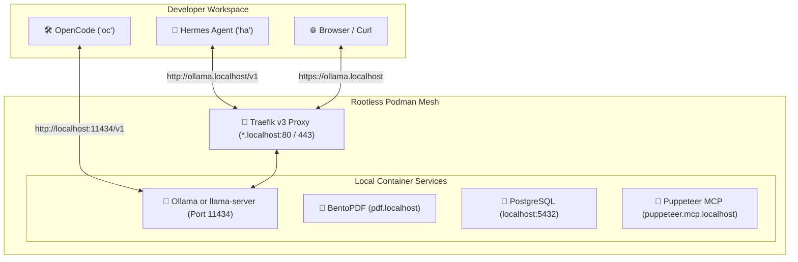

# 🚀 Feature Plan: AI Agent Model Providers & Local LLM Services

This document outlines the architectural plan, provider configurations, local inference engine evaluations, and implementation roadmap for expanding AI agent capabilities within the `setup-linux-scripts` development environment.

---

## 🎯 Executive Summary & Objectives

The current environment equips developers with two complementary agents:
* 🛠️ **[OpenCode](docs/opencode-hermes-guide.md#2-opencode-oc-scope--workflow)** (`opencode` / `oc`): Repository-centric pair programming and refactoring.
* 🤖 **[Hermes Agent](docs/opencode-hermes-guide.md#3-hermes-agent-ha-scope--workflow)** (`hermes` / `ha`): Autonomous system operator, background research, and cron automation.

### Planned Enhancements
1. **First-Class Gemini & Hosted LLM Support**: Expand Tier 1 (`install-dev-env.sh`) credential templates to include Google Gemini and multi-provider aggregators (OpenRouter, Groq).
2. **Local Lightweight LLM Support**: Enable offline, privacy-first, and zero-cost model inference for both agents via OpenAI-compatible endpoints (`http://localhost:11434/v1`).
3. **Tier 2 Local Service Integration**: Provision a containerized local inference engine inside the rootless Podman container mesh (`install-local-services.sh`), routed dynamically through Traefik v3 with `*.localhost` SSL and managed via `jl` task runner commands.

---

## ☁️ 1. Hosted LLMs & Gemini API Integration

Both OpenCode and Hermes Agent support hosted model providers beyond OpenAI and Anthropic.

### 1.1 Google Gemini Configuration
Google's Gemini models (such as `gemini-2.5-pro` and `gemini-2.0-flash`) offer massive context windows (up to 1M–2M tokens) and competitive pricing/free tiers.

* **Target File**: `~/.bashrc.local` (managed via [`.bashrc`](.bashrc#L148))
* **Environment Variables**:
  ```bash
  # Google Gemini API Credentials
  export GEMINI_API_KEY="AIzaSyYourGeminiApiKeyHere"
  export GOOGLE_GENERATIVE_AI_API_KEY="AIzaSyYourGeminiApiKeyHere"
  ```
* **Agent Integration**:
  * **OpenCode**: Select model via CLI flag (`oc --model gemini-2.5-pro`) or interactively with `/model`.
  * **Hermes Agent**: Configured via `hermes setup` or under `~/.hermes/config.yaml` using LiteLLM provider syntax (`gemini/gemini-2.0-flash`).

### 1.2 Multi-Provider Aggregators (OpenRouter / Groq / DeepSeek)
To access hundreds of models (including DeepSeek V3/R1, Claude 3.5, and Llama 3.3) under one billing key:
```bash
# OpenRouter (Unified Gateway)
export OPENROUTER_API_KEY="sk-or-v1-..."

# Groq (Ultra-Low Latency Inference)
export GROQ_API_KEY="gsk_..."
```

---

## 💻 2. Local Lightweight LLMs

Running models locally allows private, offline development and zero API cost for routine tasks like linting, git commit generation, and small refactors.

### 2.1 Recommended Models for Coding & Agent Workflows

| Model | Parameter Size | RAM / VRAM Req. | Best Use Case | Strengths |
| :--- | :--- | :--- | :--- | :--- |
| **`qwen2.5-coder:7b`** | 7 Billion | ~6–8 GB | Primary daily coding partner | State-of-the-art coding benchmark scores for its size, strong tool calling. |
| **`qwen2.5-coder:1.5b` / `3b`** | 1.5B / 3B | ~2–4 GB | Low-spec CPU / battery mode | Blazingly fast token generation on pure CPU. |
| **`llama3.2:3b`** | 3 Billion | ~3–4 GB | Hermes autonomous tasks & research | Strong instruction following, fast summarization, low memory footprint. |
| **`deepseek-coder-v2:lite`** | 16B (MoE) | ~14–18 GB | Complex multi-file refactoring | Mixture-of-Experts architecture with 236B-like coding quality at low active parameter cost. |

---

## ⚖️ 3. Local Inference Engine Evaluation: Ollama vs. Alternatives

While **Ollama** is popular for quick installs, several alternatives offer substantial advantages for developers and agentic workflows:



### Detailed Engine Comparison

| Feature | `Ollama` | `llama-server` (`llama.cpp`) | `SGLang` | `vLLM` | `LocalAI` |
| :--- | :--- | :--- | :--- | :--- | :--- |
| **Underlying Runtime** | `llama.cpp` (wrapped in Go) | Native C++ | Python / CUDA / C++ | Python / CUDA / C++ | Go + C++ bindings |
| **Memory Footprint** | Moderate (daemon overhead) | **Minimal** | High (VRAM hungry) | High (VRAM hungry) | Moderate |
| **Model Storage** | Opaque internal blobs | **Direct `.gguf` files** | Safetensors / AWQ / FP8 | Safetensors / AWQ / FP8 | GGUF / HuggingFace |
| **Prompt Prefix Caching** | Limited | Basic slot reuse | **RadixAttention (Best for agents)** | PagedAttention | Basic |
| **Ideal Hardware** | CPU, Metal, basic GPU | CPU, Apple Silicon, any GPU | Dedicated NVIDIA GPU | Dedicated NVIDIA/AMD GPU | CPU / Container Host |
| **Agent Suitability** | Good | **Excellent (Lean & direct)** | **Best (Ultra-fast multi-turn)** | High throughput | Good |

### Verdict
1. **Default Local Engine Recommendation for CPU / macOS / Modest Systems**:
   **`llama.cpp` (`llama-server`)**: Eliminates the Go daemon overhead of Ollama, loads any `.gguf` directly without model import steps, and provides an exact OpenAI-compatible API.
2. **Power-User Recommendation for Dedicated NVIDIA GPUs**:
   **`SGLang`**: The **RadixAttention** engine delivers massive speedups for agents because OpenCode and Hermes repeatedly re-transmit system prompts, codebase context, and tool histories. SGLang reuses the existing KV cache across turns rather than re-computing tokens.

---

## 🏗️ 4. Tier 2 Local Services Integration Architecture

Local LLM engines can be hosted directly inside the user-space container mesh provided by [`install-local-services.sh`](install-local-services.sh) and controlled with the `jl` task runner.

### 4.1 Architecture Diagram



### 4.2 Compose Configuration Snippet
Add the local LLM service to `~/.local/share/local-services/docker-compose.yml`:

```yaml
  # 🦙 Local LLM Inference Service (Ollama / llama-server)
  ollama:
    image: ollama/ollama:latest
    container_name: local-ollama
    restart: unless-stopped
    ports:
      - "11434:11434"
    volumes:
      - ollama-models:/root/.ollama
    networks:
      - local-mesh
    labels:
      - "traefik.enable=true"
      - "traefik.http.routers.ollama.rule=Host(`ollama.localhost`)"
      - "traefik.http.routers.ollama.entrypoints=web,websecure"
      - "traefik.http.routers.ollama.tls=true"
      - "traefik.http.services.ollama.loadbalancer.server.port=11434"
      - "io.containers.autoupdate=registry"

volumes:
  postgres-data:
  ollama-models:
```

### 4.3 Container vs. Bare-Metal Host Deployment Decision
* **Containerized via `jl`**:
  * **When to use**: Standard CPU inference, cloud VPS deployment, unified service lifecycle management (`jl up` / `jl down`), automatic Traefik SSL (`https://ollama.localhost`).
* **Bare-Metal Installation (Host)**:
  * **When to use**: Machines with dedicated hardware acceleration (NVIDIA CUDA, AMD ROCm, Apple Metal).
  * **Why**: Running directly on the host bypasses rootless container device mapping complexity (`--device nvidia.com/gpu=all` and CDI specifications).

---

## 🗺️ 5. Implementation Roadmap

### Phase 1: Tier 1 Credential Stubs (`install-dev-env.sh`)
* [ ] Update the `~/.bashrc.local` stub generator in [`install-dev-env.sh`](install-dev-env.sh#L722) to include:
  ```bash
  # Google Gemini
  # export GEMINI_API_KEY="your-gemini-api-key"

  # OpenRouter / Unified Gateway
  # export OPENROUTER_API_KEY="your-openrouter-key"

  # Local LLM Backend (Ollama / llama-server / vLLM)
  # export OPENAI_BASE_URL="http://localhost:11434/v1"
  # export OPENAI_API_KEY="ollama"
  ```
* [ ] Update [`docs/opencode-hermes-guide.md`](docs/opencode-hermes-guide.md) with model-switching examples for Gemini and local backends.

### Phase 2: Tier 2 Local Service Mesh (`install-local-services.sh`)
* [ ] Add an optional `--with-llm` flag or prompt in `install-local-services.sh` to scaffold the Ollama / `llama-server` container.
* [ ] Add model management tasks to `justfile`:
  * `jl llm-pull <model>`: Pull a model into the container.
  * `jl llm-list`: List downloaded models.
  * `jl llm-status`: Check inference engine health and memory usage.

### Phase 3: Verification & Diagnostics
* [ ] Add an end-to-end connectivity check command:
  ```bash
  curl -s http://localhost:11434/v1/models | jq .
  ```
* [ ] Validate fallback handling in OpenCode and Hermes when the local endpoint is unreachable.
